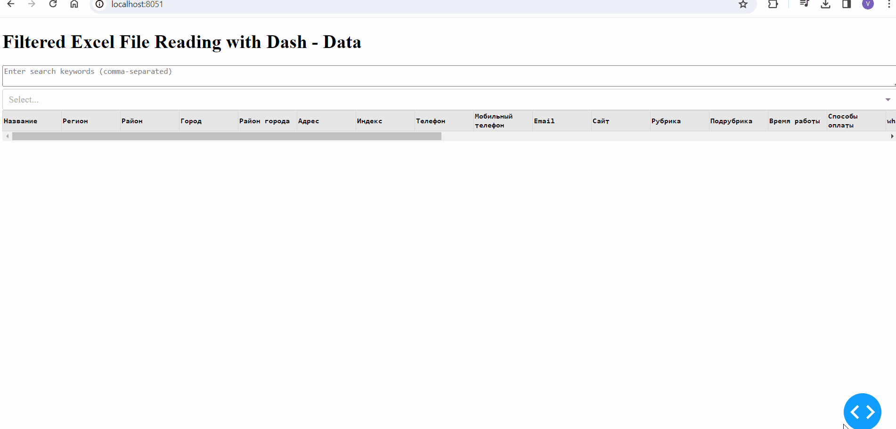
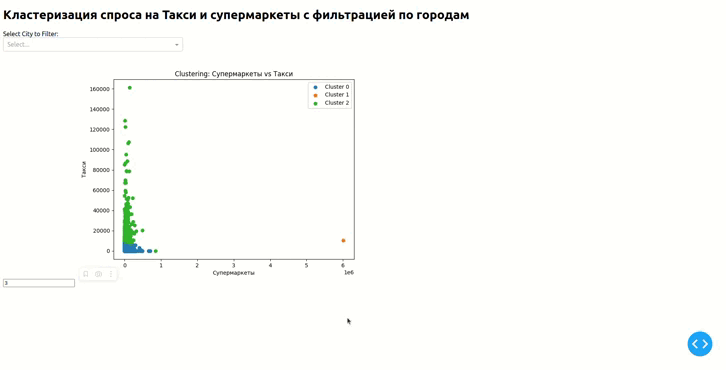

# X-MAS HACK 2023
## Предсказание потребностей и болей клиентов

### Описание кейса
Цель - разработка целевых продуктов, подрывных инноваций, которые решают конкретную задачу клиента.  Более точное формирование уникального торгового предложения.
 

Проблема - длинный цикл между стадией исследования болей и потребностей клиентов и стадией разработки продукта. Из-за чего скорость вывода продуктов замедляется. Разработка продуктов не всегда решает конкретную задачу пользователя.

Задача - разработать модель, которая может предсказывать потенциальную боль (в финансовой/нефинансовой сфере) и проблему клиента в конкретном отраслевом сегменте на базе характера ведения клиентом его бизнеса, объема бизнеса, общего состояния отрасли.

Для решения задачи могут быть использованы различные датасеты, выбранные командой (внутренние датасетов не предоставляется), такие, как данные о клиентах (статистические данные, собранные данные из открытых источников, история транзакций, предпочтения), данные о рыночном спросе (статистика продаж, потребительские индексы), данные о конкурентах (продукты и услуги, цены, маркетинговые активности) и другие данные, связанные с указанной выше отраслью в части использования финансовых и не финансовых инструментов/продуктов.

Итоговый результат: Просмотр результатов сформированных разработанными моделями, проверки возможности дальнейшего обогащения данными и сравнении их с имеющимся анализом.

### Описание задачи
Разработайте приложение, которое будет автоматически запоминать запросы и соответствующие ответы от тестовых
сред партнеров, а при повторных запросах — использовать сохраненные данные. Цель создания приложения —
снижение зависимости тестовой среды QIWI от состояния внешних тестовых сред партнеров, например банковэквайеров или Системы быстрых платежей (СБП). 

### Установка
Клонируйте репозиторий на свой ПК:

```
git clone https://github.com/lugozash/Netrunners-x-Xmas.git
```

Создайте виртуальное окружение:

```
python3 -m venv venv
```

Активируйте venv:
- Windows:

  ```
  source venv/Scripts/activate
  ```
- Unix/macOS:

  ```
  source venv/bin/activate
  ```

Установите записимости из файла requirements.txt: 

```
pip install -r requirements.txt
```

## geo_filter_tab.py
Запущено на http://194.163.137.219:8050/
Показывает фильтрацию данных из 2гис и отображает на карте
```bash
python geo_filter_tab.py
```


## prototypes
### data_tab.py
http://194.163.137.219:8051/
Показывает интерактивную таблицу о ЦА
```bash
python data_tab.py
```


### dashboard.py
Интерактивный дэшборд v0
Кластеризует покупателей по городу/покупкам в двух категориях. Кол-во кластеров настраивается. 
Запущено на http://194.163.137.219:8052/
```bash
python dashboard.py
```

### rolan_data/target_audience_analysis.ipynb
Прототип анализа ЦА
## Geo_Analytics.ipynb
Прототип анализа 2гис.


## data
### filename
df.info() for the file

### data/Приложение_4_Реестр_по_оборотам_для_кейса.xlsx
```
<class 'pandas.core.frame.DataFrame'>
RangeIndex: 65445 entries, 0 to 65444
Data columns (total 30 columns):
 #   Column                    Non-Null Count  Dtype 
---  ------                    --------------  ----- 
 0   Клиент                    65445 non-null  object
 1   Сегмент                   64592 non-null  object
 2   Пол                       65445 non-null  object
 3   Возраст                   65445 non-null  int64 
 4   Город                     65445 non-null  object
 5   Авто                      65445 non-null  object
 6   АЗС                       65445 non-null  object
 7   Аренда авто               65445 non-null  object
 8   Дом и ремонт              65445 non-null  object
 9   Животные                  65445 non-null  object
 10  Здоровье                  65445 non-null  object
 11  Кафе и рестораны          65445 non-null  object
 12  Книги                     65445 non-null  object
 13  Коммунальные услуги       65445 non-null  object
 14  Красота                   65445 non-null  object
 15  Образование               65445 non-null  object
 16  Одежда и обувь            65445 non-null  object
 17  Путешествия               65445 non-null  object
 18  Развлечения               65445 non-null  object
 19  Связь, интернет и ТВ      65445 non-null  object
 20  Спортивные товары         65445 non-null  object
 21  Супермаркеты              65445 non-null  object
 22  Такси                     65445 non-null  object
 23  Техника                   65445 non-null  object
 24  Транспорт                 65445 non-null  object
 25  Фастфуд                   65445 non-null  object
 26  Фастфуд, кафе, рестораны  65445 non-null  object
 27  Цветы                     65445 non-null  object
 28  Цифровые товары           65445 non-null  object
 29  Ювелирные изделия         65445 non-null  object
dtypes: int64(1), object(29)
memory usage: 15.0+ MB
```
## Exploratory analysis


## Команда

- Агафонова Надежда (Капитан)

- Имангулов Ролан

- Владимир Петров

- Данила Романов

- Артем Шведчиков
